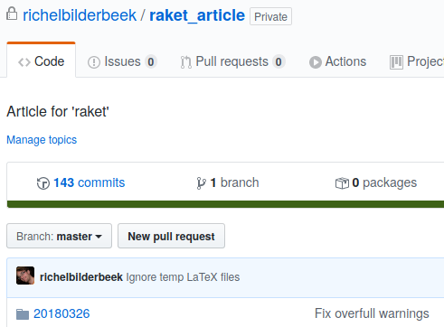
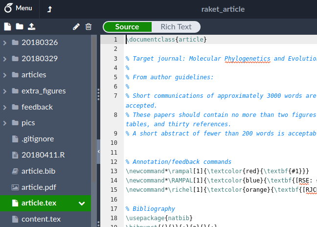

My Workflow
========================================================
author: Richel J.C. Bilderbeek
autosize: true

[https://github.com/richelbilderbeek/oscg_my_workflow](https://github.com/richelbilderbeek/oscg_my_workflow)


An all too common sentence
========================================================

> We predicted that ...
>
> [Many papers]

Open Science for me
========================================================

 * <strike>Open</strike> Science
 * Structured workflow

***

> Science means
> never having to say
> 'Trust me'
>
> Simine Vazire


Workflow
========================================================

 * Compatible with professor 
 * Good Enough (please share if you think not)

1. Write until preregistration
========================================================

Research question -> Hypotheses -> Methods -> Results

1. Write until preregistration
========================================================

 * History/timestamping
 * Private until publication


***



1. Write until preregistration
========================================================

 * Beginner-friendly
 * Collaboration

```
[OverLeaf logo]
```

***




2. Pre-register at OSF
========================================================

```
[OSF of raket]
```

3. Do experiment
========================================================

4. Write until publishable
========================================================

5. Submit to journal
========================================================

6. Publish draft on BioRxiv
========================================================

7. Publish
========================================================

8. Make GitHub repo public
========================================================


Overview
========================================================

Article                     |Code
----------------------------|-------------------
Write until pre-registration|.
Pre-register at OSF         |.
Do experiment               |Submit public code for peer-review
Write until publishable     |.
Publish                     |.
Make GitHub repo public     |Make GitHub repo public
